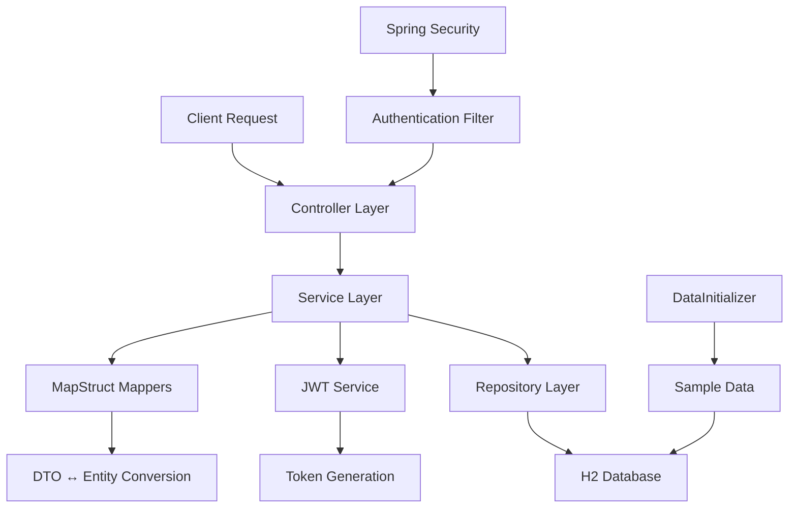
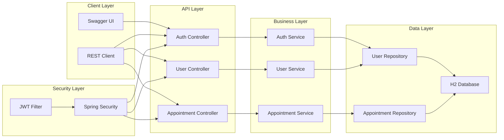

# E-Randevu API Documentation

## 🏥 Overview

Modern Spring Boot-based hospital appointment management system with JWT authentication, role-based authorization, and comprehensive REST API.

## 🚀 Features

### 🔐 Authentication & Authorization
- JWT token-based authentication
- Role-based access control (ADMIN, DOCTOR, PATIENT)
- Secure password hashing with BCrypt
- User registration and login

### 👥 User Management
- CRUD operations for users
- Role assignment and management
- Account status control
- Profile management

### 📅 Appointment System
- Appointment creation and management
- Time conflict prevention
- Status tracking (SCHEDULED, COMPLETED, CANCELLED, NO_SHOW)
- Doctor-patient matching

### 📊 Schedule Management
- Doctor working hours
- Time slot management
- Availability checking
- Conflict prevention

## 🛠️ Technology Stack

- **Backend:** Spring Boot 3.4.0, Java 21
- **Security:** Spring Security, JWT
- **Database:** H2 (In-Memory), Spring Data JPA
- **Documentation:** OpenAPI 3.0, Swagger UI
- **Build Tool:** Maven
- **Code Quality:** Lombok, MapStruct

## 📦 Architecture

```
┌─────────────────┐
│   Controller    │ ← REST API Endpoints
├─────────────────┤
│     Service     │ ← Business Logic
├─────────────────┤
│   Repository    │ ← Data Access Layer
├─────────────────┤
│     Entity      │ ← Database Models
└─────────────────┘
```

### 🔄 Data Flow Architecture



### 🏗️ System Architecture



## 🚀 Quick Start

### Prerequisites
- Java 21+
- Maven 3.6+

### Installation

1. **Clone the repository**
```bash
git clone <repository-url>
cd e-randevu
```

2. **Build and run**
```bash
mvn clean install
mvn spring-boot:run
```

3. **Access the application**
- API Base URL: `http://localhost:8080`
- Swagger UI: `http://localhost:8080/swagger-ui.html`
- H2 Console: `http://localhost:8080/h2-console`

## 📚 API Documentation

### Authentication Endpoints

#### Register User
```http
POST /api/auth/register
Content-Type: application/json

{
  "username": "dr_john",
  "password": "password123",
  "email": "john@hospital.com",
  "firstName": "John",
  "lastName": "Doe",
  "phoneNumber": "+1234567890",
  "role": "DOCTOR"
}
```

#### Login
```http
POST /api/auth/login
Content-Type: application/json

{
  "username": "dr_john",
  "password": "password123"
}
```

### User Management Endpoints

#### Get User by ID
```http
GET /api/users/{id}
Authorization: Bearer {jwt_token}
```

#### Get All Users
```http
GET /api/users
Authorization: Bearer {jwt_token}
```

#### Get All Doctors
```http
GET /api/users/doctors
Authorization: Bearer {jwt_token}
```

#### Get All Patients
```http
GET /api/users/patients
Authorization: Bearer {jwt_token}
```

### Appointment Endpoints

#### Create Appointment
```http
POST /api/appointments
Authorization: Bearer {jwt_token}
Content-Type: application/json

{
  "doctorId": 1,
  "patientId": 2,
  "appointmentDateTime": "2024-12-25T10:30:00",
  "notes": "Regular checkup"
}
```

#### Get Appointment by ID
```http
GET /api/appointments/{id}
Authorization: Bearer {jwt_token}
```

#### Get Doctor Appointments
```http
GET /api/appointments/doctor/{doctorId}
Authorization: Bearer {jwt_token}
```

#### Get Patient Appointments
```http
GET /api/appointments/patient/{patientId}
Authorization: Bearer {jwt_token}
```

#### Cancel Appointment
```http
PUT /api/appointments/{id}/cancel
Authorization: Bearer {jwt_token}
Content-Type: application/json

{
  "cancellationReason": "Patient requested"
}
```

## 🔐 Security

### JWT Authentication
- **Token Generation:** Upon successful login
- **Token Validation:** Required for protected endpoints
- **Token Expiration:** 24 hours
- **Role-based Authorization:** Different access levels for different roles

### User Roles
- **ADMIN:** Full system access, user management
- **DOCTOR:** Manage appointments, view patient info
- **PATIENT:** Book appointments, view own records

### Password Security
- BCrypt encryption for all passwords
- No plain text password storage
- Secure password validation

## 📊 Database Schema

### Users Table
```sql
CREATE TABLE users (
    id BIGINT AUTO_INCREMENT PRIMARY KEY,
    username VARCHAR(50) UNIQUE NOT NULL,
    password VARCHAR(255) NOT NULL,
    email VARCHAR(100) UNIQUE NOT NULL,
    first_name VARCHAR(50) NOT NULL,
    last_name VARCHAR(50) NOT NULL,
    phone_number VARCHAR(20),
    role ENUM('ADMIN', 'DOCTOR', 'PATIENT') NOT NULL,
    enabled BOOLEAN DEFAULT TRUE,
    created_at TIMESTAMP,
    updated_at TIMESTAMP
);
```

### Appointments Table
```sql
CREATE TABLE appointments (
    id BIGINT AUTO_INCREMENT PRIMARY KEY,
    doctor_id BIGINT NOT NULL,
    patient_id BIGINT NOT NULL,
    appointment_datetime TIMESTAMP NOT NULL,
    end_datetime TIMESTAMP,
    notes TEXT,
    cancellation_reason TEXT,
    status ENUM('SCHEDULED', 'COMPLETED', 'CANCELLED', 'NO_SHOW') DEFAULT 'SCHEDULED',
    created_at TIMESTAMP,
    updated_at TIMESTAMP,
    FOREIGN KEY (doctor_id) REFERENCES users(id),
    FOREIGN KEY (patient_id) REFERENCES users(id)
);
```

### Schedules Table
```sql
CREATE TABLE schedules (
    id BIGINT AUTO_INCREMENT PRIMARY KEY,
    doctor_id BIGINT NOT NULL,
    day_of_week ENUM('MONDAY', 'TUESDAY', 'WEDNESDAY', 'THURSDAY', 'FRIDAY', 'SATURDAY', 'SUNDAY'),
    start_time TIME NOT NULL,
    end_time TIME NOT NULL,
    appointment_duration_minutes INT DEFAULT 30,
    active BOOLEAN DEFAULT TRUE,
    created_at TIMESTAMP,
    updated_at TIMESTAMP,
    FOREIGN KEY (doctor_id) REFERENCES users(id)
);
```

## 🧪 Testing

### Sample Users (Auto-generated)
- **Admin:** `admin/admin123`
- **Doctors:** `dr_1/password1`, `dr_2/password2`, `dr_3/password3`
- **Patients:** `patient_1/password1`, `patient_2/password2`, `patient_3/password3`, `patient_4/password4`, `patient_5/password5`

### Test Scenarios

1. **Authentication Flow**
```bash
# Register new user
curl -X POST http://localhost:8080/api/auth/register \
  -H "Content-Type: application/json" \
  -d '{"username":"test_user","password":"test123","email":"test@example.com","firstName":"Test","lastName":"User","phoneNumber":"+1234567890","role":"PATIENT"}'

# Login and get token
curl -X POST http://localhost:8080/api/auth/login \
  -H "Content-Type: application/json" \
  -d '{"username":"test_user","password":"test123"}'
```

2. **Appointment Creation**
```bash
# Create appointment with JWT token
curl -X POST http://localhost:8080/api/appointments \
  -H "Content-Type: application/json" \
  -H "Authorization: Bearer YOUR_JWT_TOKEN" \
  -d '{"doctorId":1,"patientId":2,"appointmentDateTime":"2024-12-25T10:30:00","notes":"Test appointment"}'
```

## 🔧 Configuration

### Application Properties
```properties
# Server
server.port=8080

# Database (H2)
spring.datasource.url=jdbc:h2:mem:testdb
spring.datasource.username=sa
spring.datasource.password=password
spring.h2.console.enabled=true

# JPA
spring.jpa.hibernate.ddl-auto=create-drop
spring.jpa.show-sql=true

# JWT
jwt.secret=your-secret-key-here
jwt.expiration=86400000

# OpenAPI
springdoc.api-docs.path=/api-docs
springdoc.swagger-ui.path=/swagger-ui.html
```

## 🌐 Access Points

- **Swagger UI:** http://localhost:8080/swagger-ui.html
- **API Docs:** http://localhost:8080/api-docs
- **H2 Console:** http://localhost:8080/h2-console
- **Base API:** http://localhost:8080/api

## 📝 Development Notes

### Code Quality
- **Lombok:** Reduces boilerplate code
- **MapStruct:** Type-safe DTO-Entity mapping
- **Spring Boot Actuator:** Health checks and monitoring

### Best Practices
- **Layered Architecture:** Clear separation of concerns
- **DTO Pattern:** Request/Response object separation
- **Exception Handling:** Global error handling
- **Validation:** Input validation with annotations
- **Security:** JWT-based authentication

### Performance
- **In-Memory Database:** Fast development and testing
- **Connection Pooling:** Optimized database connections
- **Caching:** Ready for Redis integration

## 🚀 Deployment

### Docker Support
```dockerfile
FROM openjdk:21-jdk-slim
COPY target/e-randevu-1.0.0.jar app.jar
EXPOSE 8080
ENTRYPOINT ["java", "-jar", "/app.jar"]
```

### Production Considerations
- **Database:** PostgreSQL or MySQL
- **Security:** HTTPS, environment variables
- **Monitoring:** Spring Boot Actuator
- **Scaling:** Load balancer ready

## 📄 License

This project is licensed under the MIT License.

## 🤝 Contributing

1. Fork the repository
2. Create a feature branch
3. Commit your changes
4. Push to the branch
5. Create a Pull Request

## 📞 Support

For questions and support, please open an issue in the repository.
